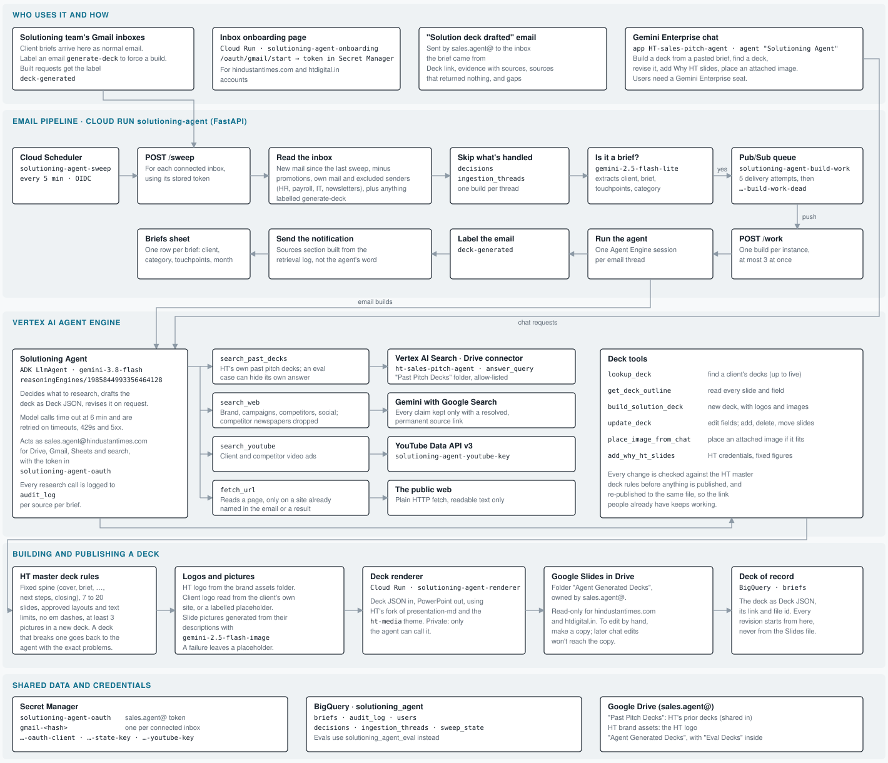

# Architecture

Read top to bottom. A brief reaches a deck in two steps on the same Cloud Run
service: `/sweep` decides what is a brief and queues it, `/work` runs the
agent and reports back. Gemini Enterprise chat reaches the same agent
directly. Every deck, from either route, goes through the same rules,
renderer and Drive folder, and is saved in BigQuery so it can be revised
later.

## The parts

| Part | Runs on | Does |
|---|---|---|
| Inbox onboarding page | Cloud Run, `solutioning-agent-onboarding` (public) | Lets a person connect their inbox; stores their access in Secret Manager |
| Email pipeline | Cloud Run, `solutioning-agent` (private) | `/sweep`: reads connected inboxes, decides what's a brief, queues it. `/work`: runs the agent for one brief, then labels the email, sends the notification and adds the sheet row |
| Inbox check schedule | Cloud Scheduler, `solutioning-agent-sweep` | Calls `/sweep` on `settings.sweep_schedule` |
| Build queue | Pub/Sub, `solutioning-agent-build-work` | Holds briefs waiting to be built; retries failures; parks repeated failures in `…-dead` |
| The agent | Vertex AI Agent Engine | Researches and builds or revises decks. ADK agent on `gemini-3.8-flash` |
| Chat | Gemini Enterprise | People talk to the agent |
| Past decks search | BigQuery, `past_deck_slides`, refreshed daily by the `solutioning-agent-past-decks` trigger | HT's past pitch decks, slide by slide, tagged with their HT IPs and solution types. The older Vertex AI Search Drive connector stays available through `settings.past_decks_source` |
| Deck renderer | Cloud Run, `solutioning-agent-renderer` (private) | Turns a deck into PowerPoint in HT's theme |
| Decks | Google Drive, as Google Slides | Read-only for HT's domains |
| Records | BigQuery, `solutioning_agent` | Every deck, email decision, brief and research call |

Details of each step: [how-it-works/email-loop.md](how-it-works/email-loop.md),
[how-it-works/research.md](how-it-works/research.md),
[how-it-works/decks.md](how-it-works/decks.md),
[how-it-works/chat-and-revisions.md](how-it-works/chat-and-revisions.md).
Every resource by name: [operations/resources.md](operations/resources.md).

## Models

| Where | Model |
|---|---|
| Is this email a brief? | `gemini-2.5-flash-lite` |
| The agent: research plan, drafting, revisions | `gemini-3.8-flash` |
| Web research with Google Search | `gemini-3.8-flash` |
| Past-deck index: reading picture-only pages, tagging | `gemini-3.8-flash` |
| Past-deck index: search by meaning | `text-embedding-005` |
| Slide pictures | `gemini-2.5-flash-image` |
| Eval judge | `gemini-2.5-pro` |

All except the embedding model are set in `config.yaml`.

## Identities

The agent acts as **sales.agent@hindustantimes.com** for everything that
touches Google Workspace (Drive, Slides, Sheets, Gmail sending, past decks
search), because Workspace search accepts only an HT identity. Cloud
resources run as the project's default compute service account. Each
connected inbox is read with that person's own grant, used only to list,
read and label their email. See
[operations/access-and-credentials.md](operations/access-and-credentials.md).

## Design choices

- **One agent, two ways in.** Email and chat use the same agent and the same
  tools, so a deck built from email can be revised in chat.
- **The deck of record is data, not the Slides file.** Revisions change the
  stored deck and re-publish the whole file under the same id, which is why
  the Slides file is read-only.
- **Rules are enforced in code, not left to the model.** The deck structure,
  text limits, competitor filter and source links are checked by
  the tools, so a rule holds even when the model forgets it.
- **Every research call is logged.** The email's sources section and the
  weekly report read the log, not the agent's account of its own work.
